<picture>
  <source media="(prefers-color-scheme: dark)" srcset="https://raw.githubusercontent.com/suecarjayeswal/suecarjayeswal/main/assets/banner-dark.svg">
  <source media="(prefers-color-scheme: light)" srcset="https://raw.githubusercontent.com/suecarjayeswal/suecarjayeswal/main/assets/banner-light.svg">
  
</picture>

I started by building things with my hands. Modifying an Android APK in Android Studio so it would log raw WiFi telemetry across campus, synchronized with multi-satellite GPS geotags. Writing a native desktop puzzle game in C++ where the stubborn challenge was coding believable gravity for tubes dropping into columns alongside a custom undo/redo state stack. Spending nine months rebuilding an automated execution engine in Rust from scratch to learn what sub-millisecond throughput demands from OS scheduling, lock-free ring buffers, and CPU cache-line alignment. Designing Bayesian MCMC samplers over heavy-tailed market volume distributions, and evolving non-standard trading indicator parameters via genetic algorithms across an 11-year backtest.

Somewhere after second year, I began looking underneath the code at the mathematical machinery governing what I had been writing. I started producing expositions—pulling theorems, discrete geometries, and algebraic structures apart until I could **modify** the machinery rather than merely cite it. Reading widely mattered immensely here: economics, philosophy, design, physics, and ecology each gave a concrete, spatial intuition to how I read a proof.

The computational foundation never left. Being able to think in both abstract mathematics and bare-metal systems is what moves me, and it is why I can sprint at a problem for a year without losing momentum.

Today, my core focus is **Artificial Reasoning and Mathematical Modeling**—whether in trade algorithms, artificial creativity, non-equilibrium economic systems, or autonomous topological memory architectures. I have yet to meet a problem I could not make deeply interesting by looking at it long enough.

**[Multi-facility allocation in network flow models: a case study](https://doi.org/10.70530/kuset.v20i1.721)** · *KUSET* 20(1), 2026 · two further articles under review · writing at **[swikarjaiswal.com.np](https://swikarjaiswal.com.np)**

---

### How the work connects

```mermaid
%%{init: {'theme':'base','themeVariables':{'primaryColor':'#FBECC4','primaryTextColor':'#1C2B3A','primaryBorderColor':'#B23A2E','lineColor':'#5C5546','secondaryColor':'#EFE9D8','tertiaryColor':'#FFFDF6','fontFamily':'Georgia, serif','fontSize':'13px'}}}%%
flowchart TD
  subgraph LENSES ["<b>Cross-Disciplinary Foundations</b>"]
    E["<b>Economics & Finance</b><br/><i>market microstructure · incentives</i>"]
    P["<b>Philosophy & Cognition</b><br/><i>hallucination · stopping criteria</i>"]
    S["<b>Systems & OS Internals</b><br/><i>lock-free buffers · cache alignment</i>"]
    Y["<b>Physics & Earth Observation</b><br/><i>Sentinel-1 SAR · dynamical systems</i>"]
  end

  subgraph THEORY ["<b>Theoretical Machinery & Expositions</b>"]
    T1["<b>Network Flows over Time</b><br/><i>transshipment · contraflow tractability</i>"]
    T2["<b>Discrete Geometry & Graphs</b><br/><i>recourse hyperplanes · Mantegna MST</i>"]
    T3["<b>Stochastic Inference</b><br/><i>PyMC NUTS · heavy-tailed priors</i>"]
    T4["<b>Algebraic Structures</b><br/><i>GF(2^8) AES · elliptic curve group law</i>"]
  end

  subgraph ENGINES ["<b>Computational Engines & Systems</b>"]
    C1["<b>Margadarshan</b><br/><i>offline Gemma 4 · confidence graphs</i>"]
    C2["<b>Rust Trading Engine</b><br/><i>sub-ms order book · lock-free SPSC</i>"]
    C3["<b>Slime Mould + SAR</b><br/><i>ESA SNAP GPF · Otsu flood masks</i>"]
    C4["<b>PyMC Anomaly & GA</b><br/><i>R̂=1.00 · parameter evolution (+44.1%)</i>"]
    C5["<b>Telemetry & Native DSA</b><br/><i>APK WiFi/GPS · C++ gravity physics</i>"]
  end

  subgraph FRONTIER ["<b>The Frontier: Reasoning & Modeling</b>"]
    R1["<b>Artificial Reasoning & Memory</b><br/><i>topological context · self-limiting loops</i>"]
    R2["<b>Frontier Market & Trade Modeling</b><br/><i>non-equilibrium dynamics · execution</i>"]
    R3["<b>Artificial Creativity</b><br/><i>low-amplitude search + sharp evaluators</i>"]
  end

  %% Interdisciplinary to Theory & Systems
  E --> T1
  E --> T2
  P --> R1
  P --> R3
  S --> T4
  S --> C2
  Y --> T1
  Y --> C3

  %% Theory to Engines & Frontier
  T1 --> C1
  T1 --> C3
  T2 --> C4
  T3 --> C4
  T4 --> C5

  %% Engines to Frontier
  C1 -.-> R1
  C2 -.-> R2
  C3 -.-> R2
  C4 -.-> R2
  C1 -.-> R3

  style LENSES fill:#FFFDF6,stroke:#B23A2E,stroke-width:1.5px,stroke-dasharray: 3 3
  style THEORY fill:#FFFDF6,stroke:#2554A6,stroke-width:1.5px,stroke-dasharray: 3 3
  style ENGINES fill:#FFFDF6,stroke:#B23A2E,stroke-width:1.5px,stroke-dasharray: 3 3
  style FRONTIER fill:#FFFDF6,stroke:#2554A6,stroke-width:1.5px,stroke-dasharray: 3 3

  style E fill:#FBECC4,stroke:#B23A2E,stroke-width:1.5px
  style P fill:#FBECC4,stroke:#B23A2E,stroke-width:1.5px
  style S fill:#FBECC4,stroke:#B23A2E,stroke-width:1.5px
  style Y fill:#FBECC4,stroke:#B23A2E,stroke-width:1.5px

  style T1 fill:#EFE9D8,stroke:#2554A6,stroke-width:1.5px
  style T2 fill:#EFE9D8,stroke:#2554A6,stroke-width:1.5px
  style T3 fill:#EFE9D8,stroke:#2554A6,stroke-width:1.5px
  style T4 fill:#EFE9D8,stroke:#2554A6,stroke-width:1.5px

  style C1 fill:#FFFDF6,stroke:#B23A2E,stroke-width:1.5px
  style C2 fill:#FFFDF6,stroke:#B23A2E,stroke-width:1.5px
  style C3 fill:#FFFDF6,stroke:#B23A2E,stroke-width:1.5px
  style C4 fill:#FFFDF6,stroke:#B23A2E,stroke-width:1.5px
  style C5 fill:#FFFDF6,stroke:#B23A2E,stroke-width:1.5px

  style R1 fill:#FBECC4,stroke:#2554A6,stroke-width:2px
  style R2 fill:#FBECC4,stroke:#2554A6,stroke-width:2px
  style R3 fill:#FBECC4,stroke:#2554A6,stroke-width:2px
```

The dotted edges represent direct cross-domain transfers:
- **Margadarshan** transforms unstructured police text into topological edge penalties via $W_e = W_{\text{base}} / \max(C, 0.01)$, evaluated through an exact McNemar test ($p = 0.0078$).
- **Slime Mould Routing** integrates real European Space Agency (ESA) Sentinel-1 SAR satellite data—calibrating and thresholding backscatter to form dynamic flood inundation barriers across biological transport networks.
- **Contraflow Optimization (BQTC)** originated when an overnight traffic ban in Kathmandu's historic Asan market demonstrated how human greedy rerouting breaks static flow models.

---

### One result, plotted

Reversing an inbound lane adds outbound capacity, which is how you evacuate a congested corridor faster. Because directional reversals require physical resources (traffic police, barriers, signage), the central question is what a given budget buys.

The steep initial descent reflects high-leverage bottlenecks where modest budget buys rapid evacuation gains. The flat tail is the Pareto frontier where operations research hands the decision back to human policy.

---

### Selected Systems, Algorithms & Experiments

| Project | Domain / Stack | What was built & discovered |
|---|---|---|
| **[margadarshan](https://github.com/suecarjayeswal/margadarshan)** | `Python` `NetworkX` `Gemma 4` `Ollama` | **Offline road disruption intelligence.** Parses unstructured Nepali police bulletins locally via Gemma 4 (31B) into structured incident JSON. Computes multi-factor edge confidence ($C = \text{Source} \times \text{Corroboration} \times \text{Decay}$) and applies inverse confidence routing penalties. Validated via exact McNemar test ($p = 0.0078$). |
| **[automated-trading-system](https://github.com/suecarjayeswal)** | `Rust` `Lock-Free Ring Buffers` `Async` | **Sub-millisecond execution engine.** 9-month ground-up rebuild. Implements lock-free SPSC order queues, cache-line-aligned hot data structures, and deterministic zero-allocation execution paths to eliminate GC pauses and minimize OS scheduling latency. |
| **[slime-mould-sar](https://github.com/suecarjayeswal)** | `Python` `ESA SNAP GPF` `snappy` `QGIS` | **Bio-inspired disaster routing on satellite telemetry.** Combines *Physarum polycephalum* adaptive foraging heuristics with an automated ESA Sentinel-1 SAR pipeline (radiometric calibration, terrain correction, Otsu thresholding) to route around live flood inundation zones. |
| **[mcmc-anomaly-detection](https://github.com/suecarjayeswal)** | `Python` `PyMC` `ArviZ` | **Bayesian volume anomaly detection.** Log-normal likelihood model ($V \sim \text{Lognormal}(\mu, \sigma)$) sampled with No-U-Turn Sampler (NUTS) across 4 chains (2,000 draws). Verified convergence with $\hat{R} = 1.00$, $\text{ESS}_\text{bulk} > 7{,}900$, isolating statistically grounded institutional block trades. |
| **[ga-technical-indicators](https://github.com/suecarjayeswal)** | `Python` `NumPy` `LaTeX` | **Meta-heuristic parameter optimization.** Genetic Algorithm optimizing continuous parameter spaces on 11-year NEPSE data (2,522 sessions). Converged to non-standard MACD $(41, 83, 6)$ vs. textbook $(12, 26, 9)$, yielding **+44.1% net profit** while halving execution friction. |
| **[portfolio-risk-graph](https://github.com/suecarjayeswal)** | `Python` `NetworkX` `Dash` `Plotly` | **Topological market geometry.** Maps 130 securities using Mantegna ultrametric distance $d_{ij} = \sqrt{2(1-\rho_{ij})}$. Filters 8,385 correlations down to 129 MST edges; identifies systemic risk nodes and optimal diversification complements via Minimum Weighted Vertex Covers. |
| **[silent-witness](https://github.com/suecarjayeswal/2024-ecothon-ecoequation)** | `Python` `Graph Theory` `YOLO` | **Graph-based behavioral anomaly detection.** Layers spatial interaction graphs over multi-agent object detections to track recurring abusive patterns rather than individual identities. *Special Prize, BioHackathon 2024.* |
| **[filtermyfeed](https://github.com/suecarjayeswal/FiltermyFeed)** | `Python` `distilBERT` `Chrome Extension` | **Context-aware content filtering.** Self-trained NLP classifier distinguishing figurative language from actual threats (*"your eyes kill me"* vs. real harassment). *Winner, Hackest 2023.* |
| **[tube-puzzle](https://github.com/suecarjayeswal/Tube_Puzzle)** | `C++` `wxWidgets` `DSA` | **Native desktop puzzle game.** Custom gravity physics simulation for falling tube fluids into discrete columns, featuring a memory-efficient stack-based undo/redo state machine. |
| **[wifi-signal-heatmap](https://github.com/suecarjayeswal)** | `Android Studio` `Python` `Folium` | **Spatial RF telemetry & multi-satellite geotagging.** Modified an Android APK to log raw WiFi RSSI metrics synchronized with multi-constellation satellite GPS, interpolating campus-wide spatial RF heatmaps in Leaflet.js. |

<b>View first-principles coursework & mathematical implementations</b>

 

- **MATH 402 Cryptography & Quantum Protocols:** AES-128 from scratch with finite field $\text{GF}(2^8)$ multiplication; Weierstrass Elliptic Curve group law visualizer; full Quantum Key Distribution (BB84 protocol) simulation with Bloch sphere state vectors and eavesdropper QBER detection.
- **Operating Systems Architecture:** Multi-policy CPU scheduler (FCFS, SJF, SRTF, Priority, Round Robin) with Gantt telemetry; virtual memory page replacement simulator demonstrating Belady's Anomaly.
- **Galois Field $\text{GF}(2)$ CRC & Error Injection:** Polynomial division bit-level simulator benchmarking syndrome detection rates across multi-bit burst corruption models.
- **Bare-Metal C Systems:** Custom Binary Search Tree pointer benchmarks against CPU clocks; Gaussian elimination linear system solvers from scratch.

---

### Expositions & How I Think

I write expositions to deconstruct complex machinery until the geometry becomes intuitive:

- **[The Recourse Hyperplane in Submodularity](https://swikarjaiswal.com.np/explorations/submodularity-geometry):** Why submodularity ($f(A \cup B) + f(A \cap B) \le f(A) + f(B)$) is not merely a discrete set inequality, but a question of vector cone projections against the active constraint manifold of dual linear programs.
- **[When Physical Reality Breaks Flow Models](https://swikarjaiswal.com.np/explorations/asan-network-flow):** Simulating how vehicle bans in Kathmandu's historic Asan market cause localized queue collapses, and why dynamic contraflow (BQTC) requires algorithmic lane reversals under tight budgets.
- **[Hallucination as Key to Creativity](https://swikarjaiswal.com.np/explorations/hallucination-creativity):** Viewing creativity as rapid, low-amplitude search across high-dimensional associative spaces—where the bottleneck is not generative capacity, but sharp, topological evaluators and bounded recall criteria.
- **[Dirichlet Bounds in Continued Fraction Compression](https://swikarjaiswal.com.np/explorations):** Probing the information border between rational approximations and data compression limits.

#### Core Research & Engineering Tenets

1. **Find the structural fault first, then rebuild from it.** (I lost weeks of my thesis to a transposed incidence matrix $[\Gamma]$ vs $[\Gamma]^T$ because standard literature treated them loosely; tracking down that exact fault unlocked the polynomial tractability proof).
2. **Construct the smallest instance that could break the conjecture.** Build the counterexample in code before proving the general case.
3. **Report the baseline beside the result.** State clearly where the model breaks down, where assumptions fail, and what the data cannot cover.

---

  Kathmandu University · B.Sc. Computational Mathematics (Graduated 2026)
   
  
    <a href="https://swikarjaiswal.com.np">Portfolio</a> &nbsp;•&nbsp;
    <a href="https://github.com/suecarjayeswal">GitHub</a> &nbsp;•&nbsp;
    <a href="https://www.linkedin.com/in/swikarjaiswal">LinkedIn</a> &nbsp;•&nbsp;
    <a href="mailto:swikarjaiswal@gmail.com">Email</a>
  

