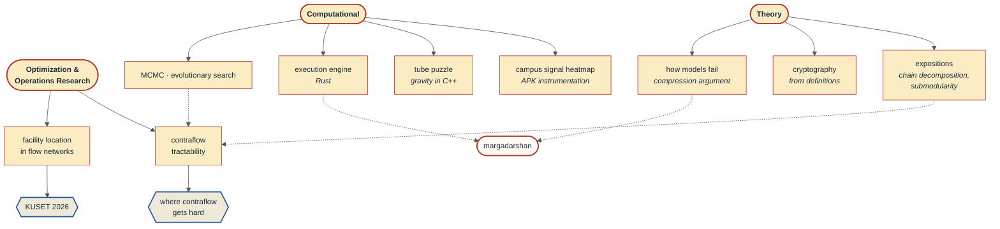

<picture>
  <source media="(prefers-color-scheme: dark)" srcset="https://raw.githubusercontent.com/suecarjayeswal/suecarjayeswal/main/assets/banner-dark.svg">
  <source media="(prefers-color-scheme: light)" srcset="https://raw.githubusercontent.com/suecarjayeswal/suecarjayeswal/main/assets/banner-light.svg">
  
</picture>

I started by building things. A campus network-strength heatmap that meant modifying an APK
in Android Studio so it would log every WiFi reading, geotagged off multiple satellites. A
puzzle game in C++ where the hard part turned out to be writing gravity for tubes falling
into columns. An execution engine, a sampler, a genetic algorithm hunting good parameters.

Somewhere after second year I started looking underneath the code, at the theory and the
algorithmic concepts governing what I had been writing, and began producing expositions to
get the machinery to a point where I could change it rather than only cite it. Reading
widely mattered more than I expected here. Economics, philosophy, design, physics, and
environment each left something behind in how I read a theorem.

The computational side never left. Being able to think in both is the thing that actually
moves me, and it is why I can sprint at a problem for a year without getting bored of it.

What I want next is artificial reasoning and modeling: trade algorithms, artificial
creativity, economic modeling, anything with that shape. I have yet to meet a problem I
could not make interesting by looking at it long enough.

**[Multi-facility allocation in network flow models: a case study](https://doi.org/10.70530/kuset.v20i1.721)** ·
*KUSET* 20(1), 2026 · two further papers under review ·
writing at **[swikarjaiswal.com.np](https://swikarjaiswal.com.np)**

---

### How the work connects

The dotted edges are the ones I care about. Expositions written for their own sake turned
out to be what the tractability proof needed, and `margadarshan` only works because
unreliable claims about the world have to be weighted before they can become edge weights.

---

### One result, plotted

Reversing an inbound lane adds outbound capacity, which is how you empty a city faster. It
is also expensive, so the real question is what a given budget buys.

The steep part is free money. The flat part is where operations research hands the problem
back to a human being.

---

### Repositories

| | what it is |
|---|---|
| **[margadarshan](https://github.com/suecarjayeswal/margadarshan)** | Routing around road disruptions. A locally-run language model pulls closures out of Nepali police bulletins; each claim is scored by source reliability, corroboration, and age, and those scores become edge weights. `Python` `NetworkX` `Ollama` |
| **[silent-witness](https://github.com/suecarjayeswal/2024-ecothon-ecoequation)** | Behavioural graphs layered over object detection, tracking recurring patterns rather than identities. Most Innovative Project, Watson Code Fest 2024. `Python` |
| **[filtermyfeed](https://github.com/suecarjayeswal/FiltermyFeed)** | Browser extension filtering triggering content with a self-trained classifier. The hard part was figurative language: *your eyes kill me* is not a threat. `Python` `distilBERT` |
| **[tube-puzzle](https://github.com/suecarjayeswal/Tube_Puzzle)** | Native C++ puzzle game with a custom undo stack. Writing believable gravity for tubes dropping into columns took longer than the game did. `C++` `wxWidgets` |
| **[nepalensis](https://github.com/suecarjayeswal/nepalensis)** | Visualizing Nepal's entries in the BOLD biodiversity database. Runner-Up, Watson Crack the Code 2022. `CSS` `Python` |

---

### How I work

Find the structural fault first, then rebuild from it. In practice:

- Write the machinery out expositorily until I can **modify** it, not merely cite it.
- Construct the smallest instance that could break the conjecture, then actually build it.
- Keep the counterexamples. Most conjectures die; the survivors become theorems.
- Report the baseline beside the result, and say what the model does not cover.

I lost weeks of the thesis to confusing an incidence matrix with its transpose, because the
standard presentations treat the two interchangeably and the contraflow adaptation does not
permit that. It was the most useful mistake of the project.

---

Kathmandu University · Computational Mathematics · [swikarjaiswal.com.np](https://swikarjaiswal.com.np) · [LinkedIn](https://www.linkedin.com/in/swikarjaiswal)
