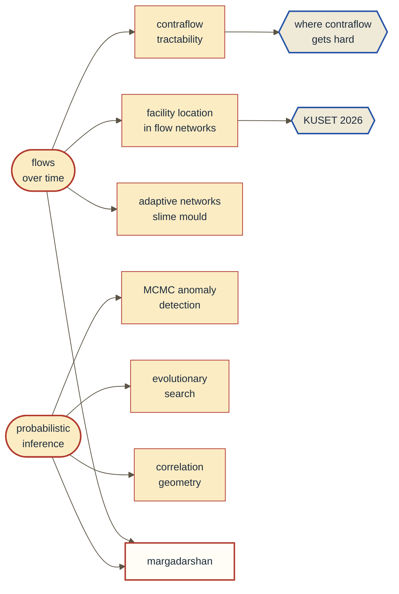

<picture>
  <source media="(prefers-color-scheme: dark)" srcset="https://raw.githubusercontent.com/suecarjayeswal/suecarjayeswal/main/assets/banner-dark.svg">
  <source media="(prefers-color-scheme: light)" srcset="https://raw.githubusercontent.com/suecarjayeswal/suecarjayeswal/main/assets/banner-light.svg">
  
</picture>

I take a problem apart into its actors, the relationships between them, and the processes
running through them, and then look for where the slack is. That habit kept me in network
flow theory for two years. Most of what is here came out of following it.

**[Multi-facility allocation in network flow models: a case study](https://doi.org/10.70530/kuset.v20i1.721)** ·
*KUSET* 20(1), 2026 · two further papers under review ·
writing at **[swikarjaiswal.com.np](https://swikarjaiswal.com.np)**

---

### How the work connects

Two roots, and nearly everything grows off one of them.

`margadarshan` is the one that needed both: claims about the world arrive unreliable and have
to be weighted before they can become edge weights.

---

### One result, plotted

Reversing an inbound lane adds outbound capacity, which is how you empty a city faster. It is
also expensive, so the real question is what a given budget is worth.

The steep part is free money. The flat part is where operations research hands the problem
back to a human being.

---

### Repositories

| | what it is |
|---|---|
| **[margadarshan](https://github.com/suecarjayeswal/margadarshan)** | Routing around road disruptions. A locally-run language model pulls closures out of Nepali police bulletins; each claim is scored by source reliability, corroboration, and age, and those scores become edge weights. `Python` `NetworkX` `Ollama` |
| **[silent-witness](https://github.com/suecarjayeswal/2024-ecothon-ecoequation)** | Behavioural graphs layered over object detection, tracking recurring patterns rather than identities. Most Innovative Project, Watson Code Fest 2024. `Python` |
| **[filtermyfeed](https://github.com/suecarjayeswal/FiltermyFeed)** | Browser extension filtering triggering content with a self-trained classifier. The hard part was figurative language: *your eyes kill me* is not a threat. `Python` `distilBERT` |
| **[nepalensis](https://github.com/suecarjayeswal/nepalensis)** | Visualizing Nepal's entries in the BOLD biodiversity database. Runner-Up, Watson Crack the Code 2022. `CSS` `Python` |

---

### How I work

Find the structural fault first, then rebuild from it. In practice:

- Write the machinery out expositorily until I can **modify** it, not merely cite it.
- Construct the smallest instance that could break the conjecture, then actually build it.
- Keep the counterexamples. Most conjectures die; the survivors become theorems.
- Report the baseline beside the result, and say what the model does not cover.

I lost weeks of the thesis to confusing an incidence matrix with its transpose, because the
standard presentations treat the two interchangeably and the contraflow adaptation does not
permit that. It was the most useful mistake of the project.

---

Kathmandu University · Computational Mathematics · [swikarjaiswal.com.np](https://swikarjaiswal.com.np) · [LinkedIn](https://www.linkedin.com/in/swikarjaiswal)
